# DiskMonitor – 文件夹空间变化追踪系统

## 📌 项目简介
**DiskMonitor** 是一款基于 **C++17/20** 开发的高性能磁盘空间监控工具，旨在**持续追踪文件夹大小变化**，帮助用户发现磁盘异常增长的目录（例如缓存、日志、着色器编译文件等），从而及时清理，节省存储空间。  

该系统支持**开机自启动**、**定时扫描**、**历史数据比对**，并可扩展到**可视化趋势分析**。  
在设计过程中，充分利用了现代 C++ 新特性与多种经典数据结构/算法，实现了性能与可维护性的平衡。

---

## 🎯 解决的问题
- **磁盘空间“隐形”消耗**：部分软件会在后台自动生成缓存文件，导致磁盘空间逐渐被占满。
- **缺乏历史变化记录**：Windows 系统默认无法查看某文件夹在不同时间点的体积变化。
- **无快速定位能力**：面对磁盘告急，用户很难迅速找到“空间杀手”所在的目录。

---

## 💡 核心功能
- **文件夹递归扫描**：利用 `std::filesystem` 遍历目录，统计总大小。
- **历史数据存储**：支持 SQLite 数据库与 CSV 文本存储两种模式。
- **大小变化检测**：基于红黑树（`std::map`）高效排序，快速找出增长/减少最多的目录。
- **定时任务**：可通过任务计划程序实现每日/每小时自动扫描。
- **数据可视化（可选）**：结合 `matplotlib-cpp` 或 `QtCharts` 绘制变化趋势折线图/柱状图。

---

## 🛠 技术栈
### 编程语言
- **C++17/20**：使用结构化绑定、`std::filesystem`、`if constexpr`、智能指针、范围 for 循环等现代特性，提高代码可读性与安全性。
- **STL 容器与算法**：`std::map`、`std::unordered_map`、`std::vector`、`std::sort`、`std::accumulate` 等。
- **多线程并行扫描**：`std::thread` 与线程池模型（可选）。

### 数据结构与算法
- **红黑树**：基于 `std::map` 的有序存储，实现文件夹大小变化的快速排序。
- **哈希表**：`std::unordered_map` 存储文件夹路径与历史记录，O(1) 访问。
- **优先队列**：快速获取变化最大的 N 个目录。
- **差分计算**：比对不同时间快照，得到变化量。

### 存储方案
- **SQLite 数据库**：轻量级嵌入式数据库，存储历史扫描数据，支持 SQL 查询。
- **CSV 文本**：便于导出与外部分析（Excel、Python 等）。

### 其他技术
- **CMake**：跨平台构建配置。
- **GitHub Actions（CI/CD）**：自动化构建与测试。
- **日志系统（spdlog）**：记录扫描状态与异常。

---
## 📊 功能模块图

```mermaid
flowchart LR
    A[启动程序] --> B[读取配置文件]
    B --> C[递归扫描文件夹]
    C --> D[计算文件夹总大小]
    D --> E[存储数据到SQLite/CSV]
    E --> F[变化分析模块]
    F --> G[红黑树排序变化结果]
    G --> H[输出报告 / 可视化]
    H --> I[用户查看结果]

```


## 📂 项目结构
```bash
DiskMonitor/
├── include/            # 头文件（类定义、接口声明）
│   ├── FileScanner.h
│   ├── DataStorage.h
│   ├── ChangeAnalyzer.h
│   ├── Visualizer.h
│   └── Config.h
│
├── src/                # 源文件（实现）
│   ├── FileScanner.cpp
│   ├── DataStorage.cpp
│   ├── ChangeAnalyzer.cpp
│   ├── Visualizer.cpp
│   └── main.cpp
│
├── data/               # 扫描结果与配置
│   ├── history.db
│   └── config.json
│
├── tests/              # 单元测试
│   ├── test_scanner.cpp
│   ├── test_storage.cpp
│   └── test_analyzer.cpp
│
├── .gitignore
├── CMakeLists.txt
└── README.md
```

```mermaid
graph TD
    subgraph Scan[扫描流程]
        S1[FileScanner] --> S2[目录遍历 std::filesystem]
        S2 --> S3[统计文件夹大小]
    end

    subgraph Store[数据存储]
        S3 --> ST1[(SQLite数据库)]
        S3 --> ST2[(CSV文件)]
    end

    subgraph Analyze[分析流程]
        ST1 --> A1[读取历史数据]
        ST2 --> A1
        A1 --> A2[差分计算]
        A2 --> A3[红黑树排序]
    end

    subgraph Visual[可视化]
        A3 --> V1[生成变化报告]
        A3 --> V2[绘制趋势图]
    end

    V1 --> U[用户查看]
    V2 --> U
